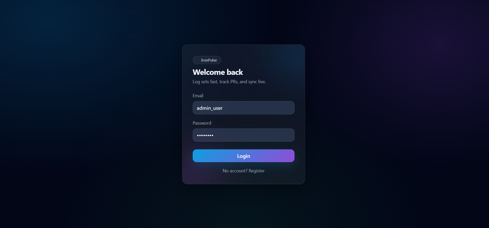
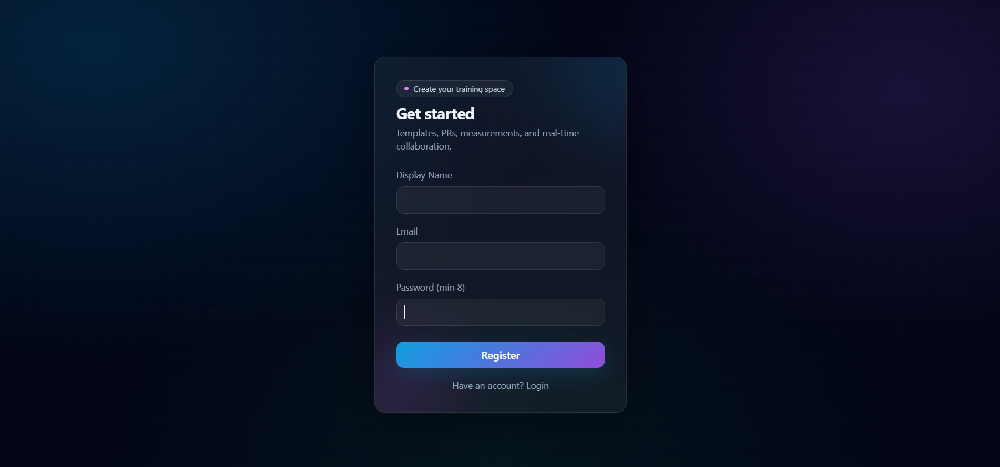
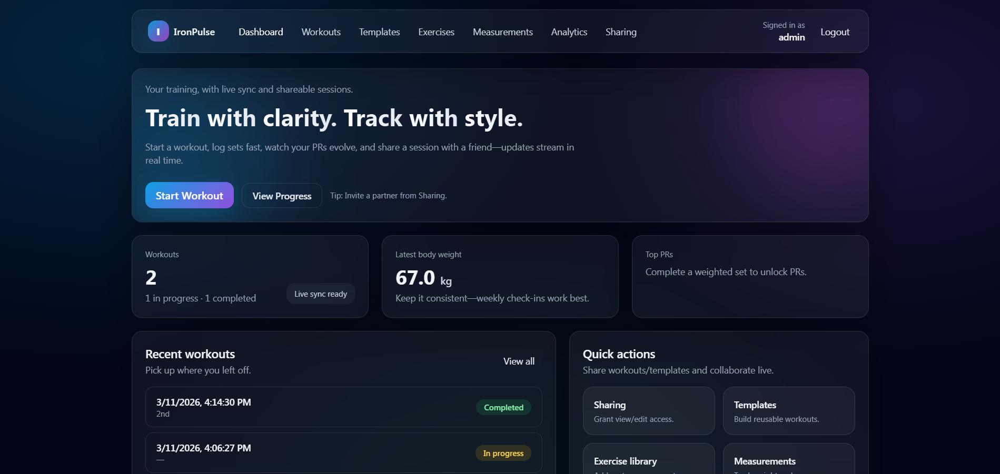
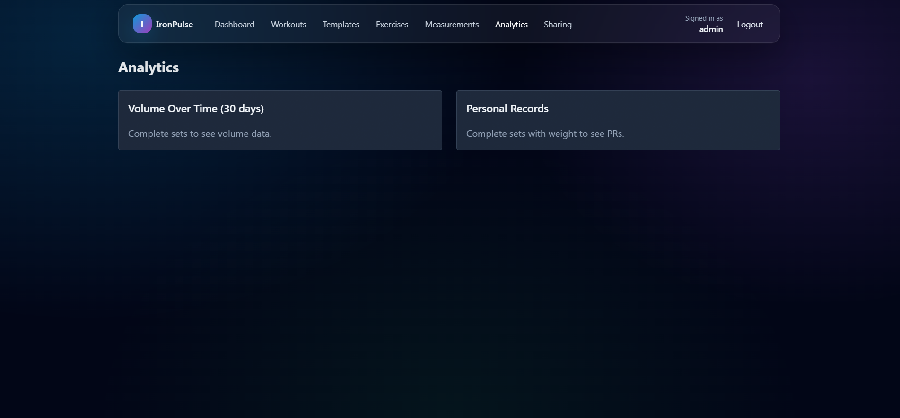
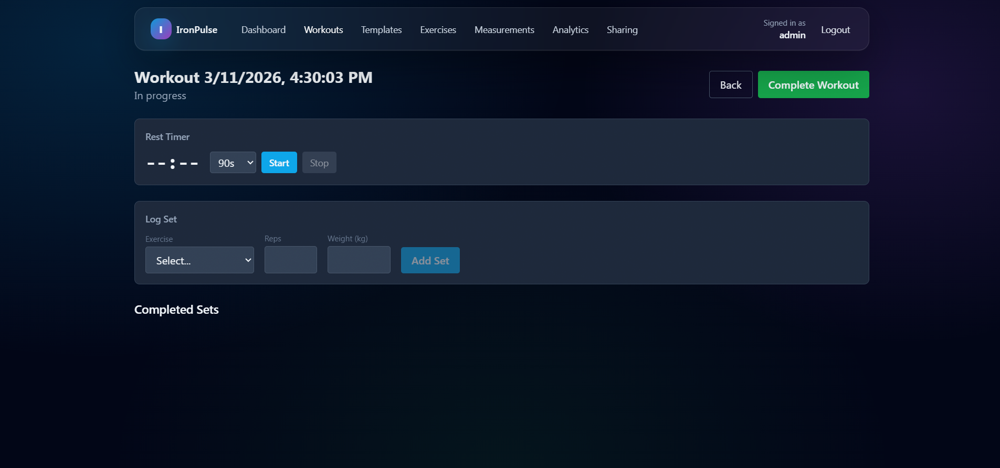
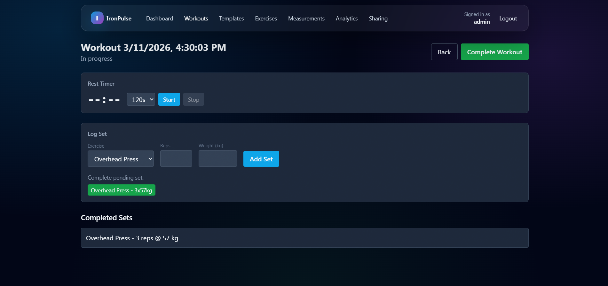
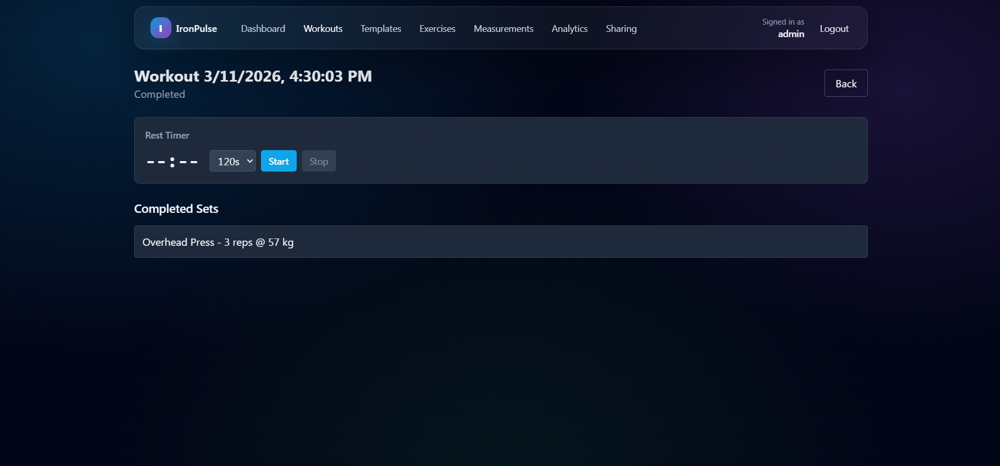
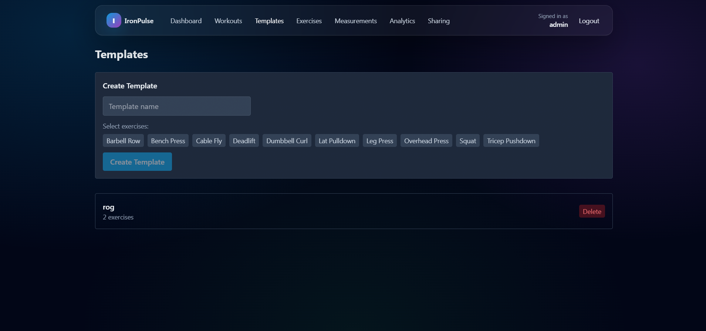
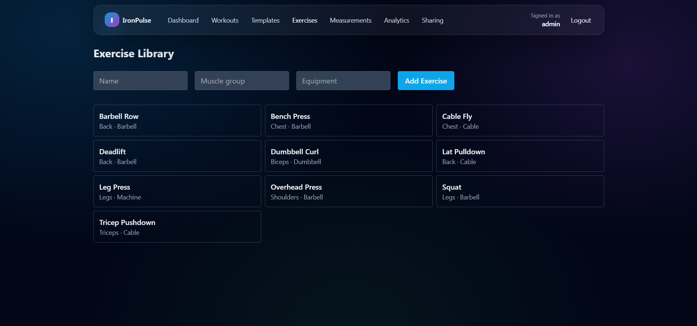
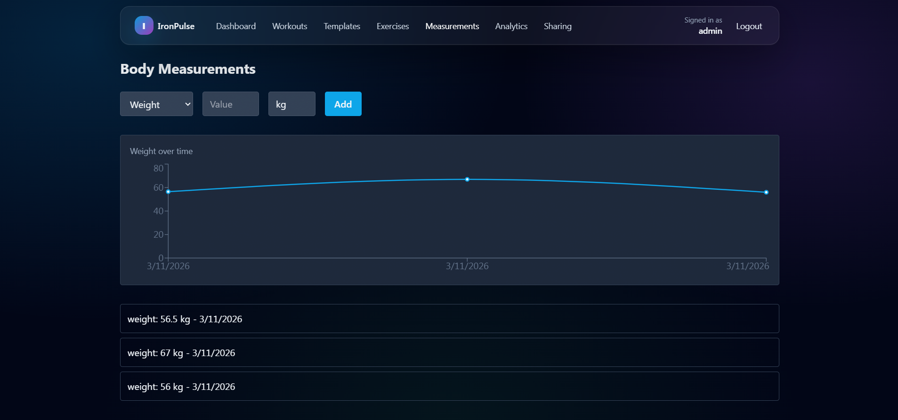

  
  
  
  
  
  
  
  
  

# 🧩 IronPulse

> **Train with clarity. Track with style.**

IronPulse is a **Full-stack Workout Management System** designed to **professionalize gym recording and team collaboration**.

The system focuses on **real-time synchronization and high-performance aesthetics** and aims to **provide users with actionable insights into their physical progress**.

---

# ✨ Key Features

| Feature | Description |
|---|---|
| **Real-time Sync** | Live workout session synchronization across multiple devices via WebSockets. |
| **Comprehensive Tracking** | Log sets, reps, weights, and rest times with a fluid, tactile interface. |
| **Bento Dashboard** | A high-density data overview of recent activity, personal records, and body stats. |
| **Exercise Library** | A searchable database of exercises with support for custom community additions. |
| **Workout Templates** | Build and reuse complex workout routines to minimize friction during training. |
| **Analytics Engine** | Visualize volume trends and personal records through interactive charts. |

---

# 🎬 Project Demonstration

The following resources demonstrate the system's behavior:

- [📹 Product Video](#-product-video)
- [📸 Screenshots](#-screenshots)
- [⚙️ Architecture Overview](#️-architecture-overview)
- [🧠 Engineering Lessons](#-engineering-lessons)
- [🔧 Key Design Decisions](#-key-design-decisions)
- [🗺️ Roadmap](#️-roadmap)
- [🚀 Future Improvements](#-future-improvements)
- [📄 Documentation](#-documentations)
- [📝 License](#-license)
- [📩 Contact](#-contact)

If deeper technical access is required, it can be provided upon request.

---

# 📹 Product Video

> **[DEMONSTRATION PENDING]**

*A comprehensive video or GIF of the system's walkthrough demonstrating the Architecture, engines, and core workflows is available soon!*

---

# 📸 Screenshots

### 🔑 Authentication

### 📊 Dashboard & Analytics

### 🏋️ Workout Execution

### 📚 Management

---

# ⚙️ Architecture Overview

IronPulse is implemented using a **Decoupled Client-Server Architecture** with a modular domain-driven backend.

### Frontend
- **React 18** with **TypeScript** for robust component logic.
- **Zustand** for lightweight, high-performance global state management.
- **Tailwind CSS** with **Glassmorphism** for a premium visual identity.

### Backend
- **NestJS** following the **Controller-Service-Repository** pattern.
- **TypeORM** for scalable database interactions.
- **SQLite** for zero-config persistence (PostgreSQL/Firebase ready).

### Communication
- **RESTful API** for stateless data operations.
- **Socket.IO** for real-time workout synchronization.

---

# 🧠 Engineering Lessons

During development of IronPulse the focus areas included:

- **Server-State Management**: Mastering React Query to bridge the gap between UI and complex backend states.
- **Real-time Synchronization**: Implementing conflict resolution and low-latency updates with WebSockets.
- **Modular Backend Design**: Structuring NestJS modules to encapsulate domain logic effectively.
- **System Architecture**: Decoupled Modular Client-Server (SPA + REST/WS) for scalability.
- **Folder Architecture**: Modular NestJS backend and component-driven React frontend.
- **Database Portability**: Designing schemas that are easily translatable between SQLite and production-grade RDBMS.

* Read more in the [Extended Engineering Lessons](docs/engineering_decisions.md) document.

---

# 🔧 Key Design Decisions

1. **Iron-Themed Glassmorphism**
   Creating a high-performance visual atmosphere that motivates the user while maintaining readability in gym environments.

2. **Bento Grid Dashboard**
   Maximizing information density for quick scannability of progress metrics and recent activities.

3. **Simplified Workflow:**
   The "Start Workout" button is the most prominent element in the UI.

4. **Tactile Micro-animations**
   Adding subtle animations to enhance the user experience and provide visual feedback.   

5. **Progress Visualization (Recharts)**
   modern, interactive charts and graphs to help users track their progress and identify trends.

6. **Modular Architecture (decoupled client-server)**
   Utilizing a Bento Grid for data scannability and a mobile-first navigation flow.

*Read more in the [Extended Design Decisions](docs/design_decisions.md) document.*

---

# 🗺️ Roadmap

Key upcoming features planned for IronPulse:

- ✅ **Phase 1: Core Engine** — Multi-user authentication and basic workout logging.
- ✅ **Phase 2: Real-time Sync** — WebSocket integration for collaborative sessions.
- 🟡 **Phase 3: Deep Analytics** — Advanced PR tracking and volumetric progress charts.
- ⭕ **Phase 4: Social Layer** — Following friends and sharing templates directly in-app.
- ⭕ **Phase 5: Offline Mode** — PWA integration for logging without a stable connection.
- ⭕ **Phase 6: Firebase Integration** — Transitioning to Firebase DB for global scalability and simplified real-time data persistence.

---

# 🚀 Future Improvements

Planned enhancements include:

- **AI Recommendations**: Suggestions based on previous volume and recovery data.
- **Dark/Light Mode Optimization**: Automatic shifting based on gym ambient light sensors.
- **Deep Analytics**: Advanced PR tracking and volumetric progress charts.

---

## 📄 Documentations

Additional documentation is available in the `docs/` folder:

| File | Description |
|---|---|
| [Engineering Decisions](docs/engineering_decisions.md) | Deep dive into technical choices and trade-offs. |
| [Design Decisions](docs/design_decisions.md) | Detailed UI/UX philosophy and visual identity. |

---

# 📝 License

This repository is published for **portfolio and educational review purposes**.

The source code may not be accessed, copied, modified, distributed, or used without explicit permission from the author.

© 2026 Viraj Tharindu — All Rights Reserved.

---

# 📩 Contact

If you are reviewing this project as part of a hiring process or are interested in the technical approach behind it, feel free to reach out.

I would be happy to discuss the architecture, design decisions, or provide a private walkthrough of the project.

**Opportunities for collaboration or professional roles are always welcome.**

📧 **Email**: [virajtharindu1997@gmail.com](mailto:virajtharindu1997@gmail.com)  
💼 **LinkedIn**: [viraj-tharindu](https://www.linkedin.com/in/viraj-tharindu/)  
🌐 **Portfolio**: [vjstyles.com](https://virajtharindu.com)  
🐙 **GitHub**: [VirajTharindu](https://github.com/VirajTharindu)  

---

  <em>Built with 🔩 and 💥 for the modern athlete.</em>

